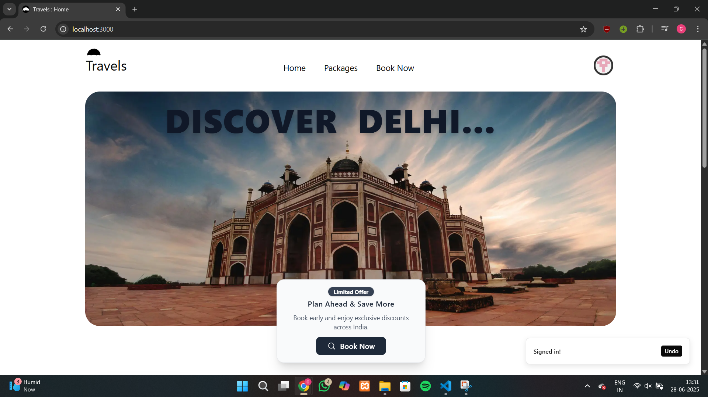
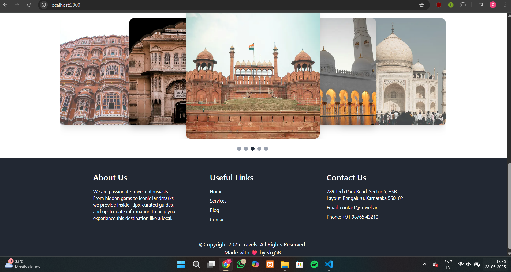
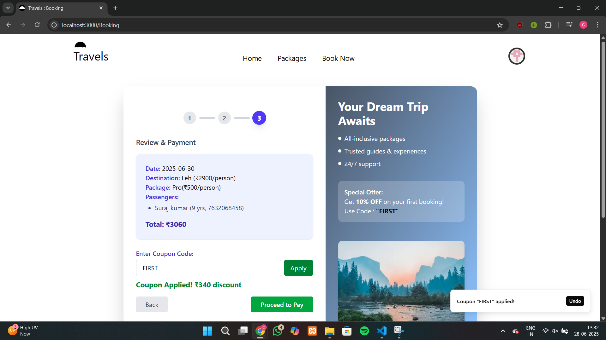
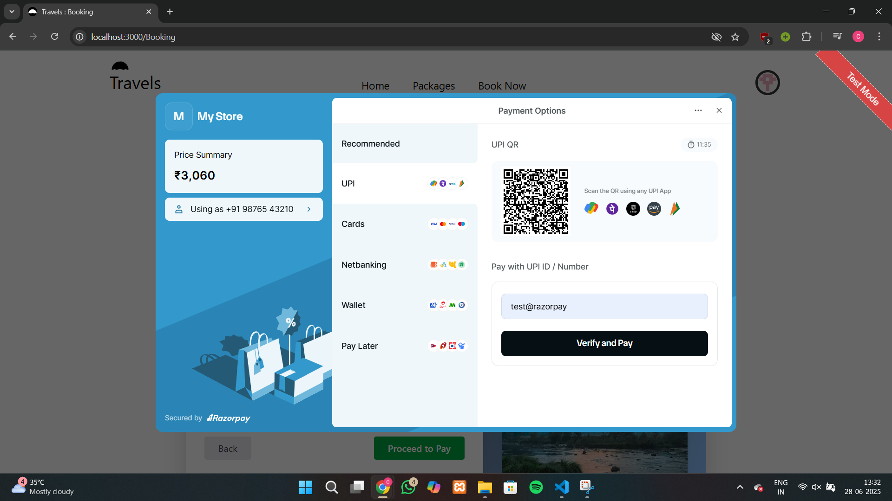
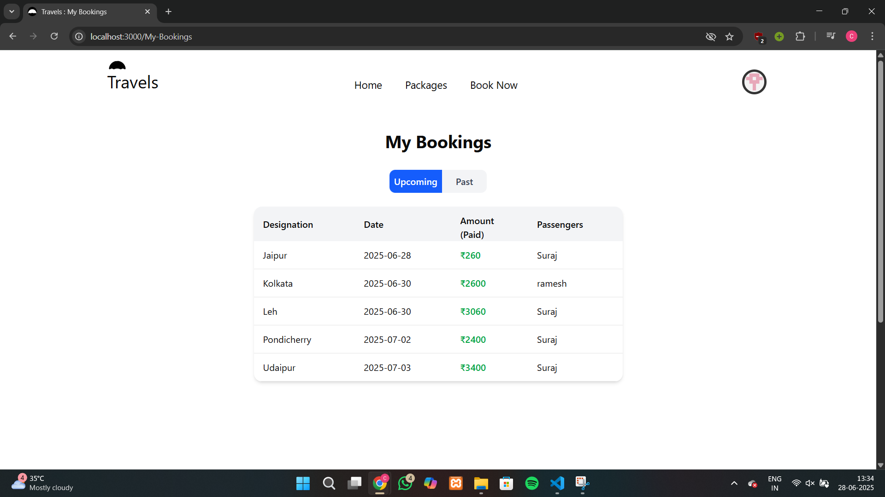
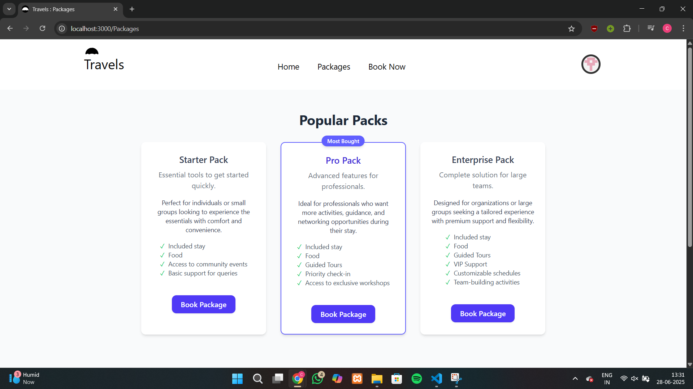
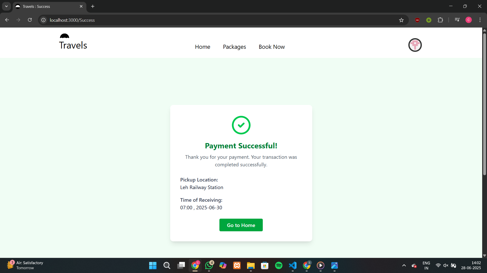
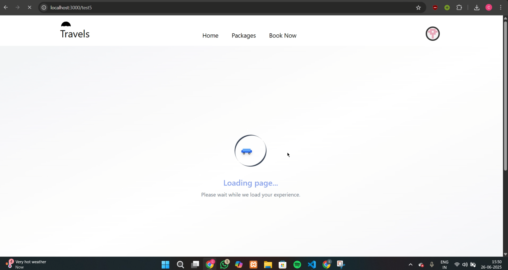

<p align="center">
  
</p>
<h1 align="center">Travels — Explore India</h1>

Travels is a comprehensive, modern travel booking web application designed to help users effortlessly explore, plan, and book trips across India. Built with the latest technologies like Next.js App Router and Tailwind CSS, it combines speed, scalability, and a beautiful responsive design to deliver a seamless user experience.

## 🚀Features

- 🗺️ Explore travel destinations across India
- 🧾 Book packages with details like date, pickup location, etc.
- 📦 Destination-based pricing
- 💸 Coupon code discounts(with dynamic coupon validation)
- 💳 Secure payment integration (Razorpay)
- 🔐 Sign in securely using NextAuth.js
- 📈 Dynamic, scalable backend with fast performance
- 📱 Mobile-responsive UI
- ⚙️ Modern Next.js App Router structure
- 🧩 Modern UI with shadcn/ui and Lordicon
- ⚡ Achieve high performance scores on Google Lighthouse (99+ scores in Performance, Accessibility, Best Practices, and SEO)

---

## 🛠️ Tech Stack

- **Frontend**: React (Next.js App Router)
- **Styling**: Tailwind CSS
- **Backend**: Serverless API Routes (Next.js)
- **Database**: MongoDB (with Mongoose)
- **Authentication**: NextAuth.js
- **Payments**: Razorpay


## 🧰 Built With


## 📸 Screenshots

| Home Page | Booking Page | 
|-----------|--------------|
|   |   |


| My-Booking Page  |  Packages Page
|-----------|--------------|
| |    |

|Success Page   | Loading...
|-----------|--------------|
| |   |

## 📄 License

This project is licensed under the [MIT License](LICENSE).  
© 2025 skg58

---
## 📦 Setup Instructions
### 1. Development Installation

If you want to contribute or modify the code, clone and run it locally.

### 2. Clone and Install Dependencies

```bash
git clone https://github.com/skg58/travels.git
cd travels
npm install
```


### 3. Environment Variables

Create a `.env.local` file in the root directory with the following:

```env
MONGODB_URI=your_mongodb_connection_string

NEXT_PUBLIC_RAZORPAY_KEY_ID=your_razorpay_key_id
RAZORPAY_KEY_SECRET=your_razorpay_secret_key

NODE_ENV=development
NEXT_PUBLIC_URL=http://localhost:3000

# If using GitHub/Google for auth
GITHUB_ID=your_github_client_id
GITHUB_SECRET=your_github_secret
GOOGLE_ID=your_google_id
GOOGLE_SECRET=your_google_secret
```

### 4. Run Development Server

```bash
npm run dev
```

Visit: [http://localhost:3000](http://localhost:3000)

---

## 🌐 Deployment (Vercel + MongoDB Atlas)

### ➤ 1-Click Deploy

[](https://vercel.com/import/project?template=https://github.com/skg58/travels)

### ➤ Add Environment Variables on Vercel

Same as in `.env.local`, set these in **Project Settings → Environment Variables**.

---

## 📧 Contact

Made with ❤️ by [[skg58]](https://github.com/skg58/Travels)


